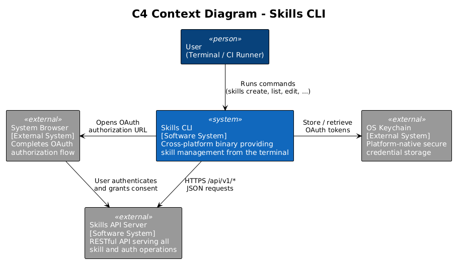
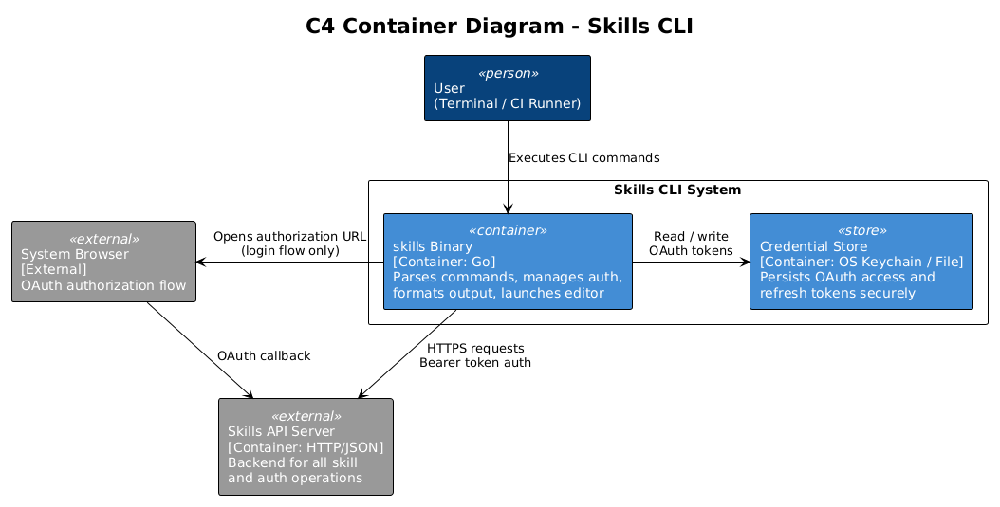
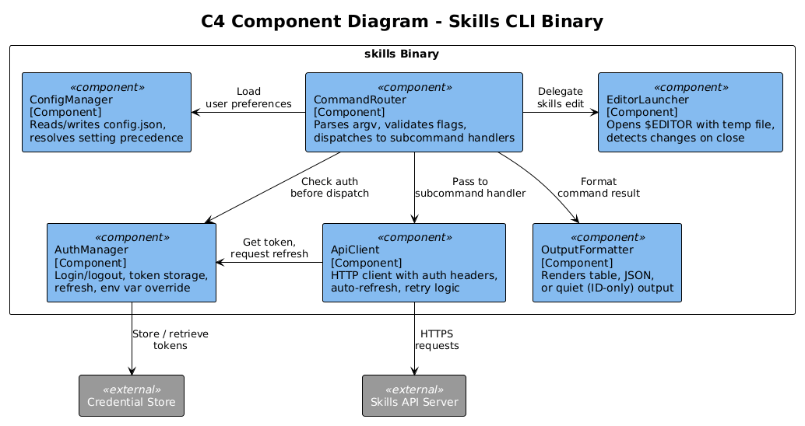
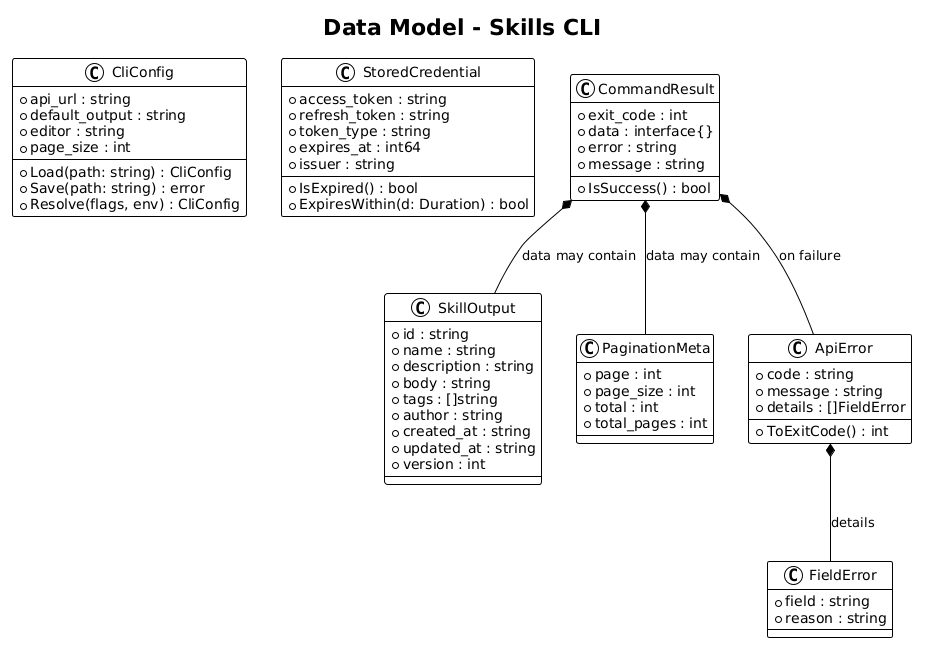
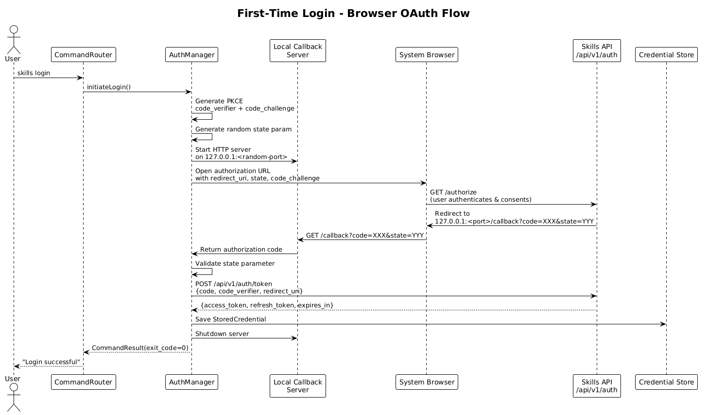
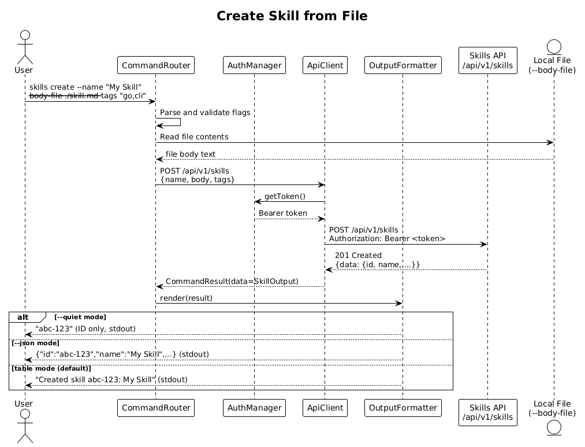
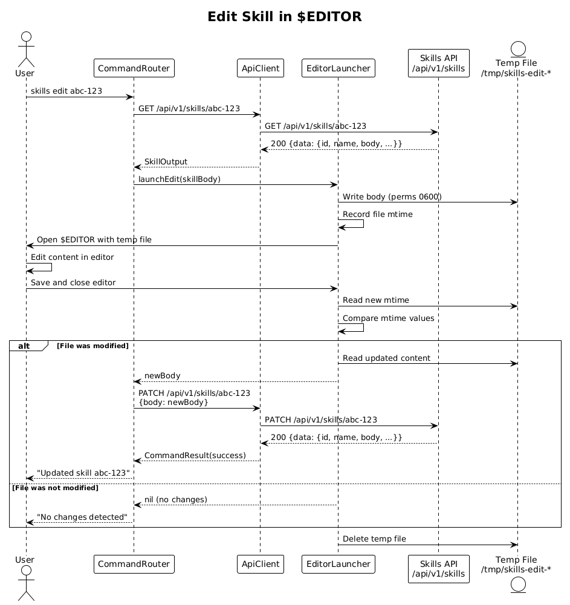

# Feature 05: Command-Line Interface -- Detailed Design

**Traces to:** L1-005, L2-015, L2-016, L2-017, L2-034

## 1. Overview

The `skills` CLI is a cross-platform binary that provides functional parity with the web UI for all skill management operations. It targets three primary personas: developers who prefer terminal workflows, operators integrating skill management into CI/CD pipelines, and scripts that automate bulk operations.

The CLI communicates exclusively with the RESTful API at `/api/v1/` and adds no server-side logic of its own. It is responsible for authentication management, command parsing, output formatting, and local editor integration.

**Key design goals:**

- Single statically-linked binary with zero runtime dependencies (recommend Go for ecosystem alignment and cross-compilation simplicity).
- Consistent, POSIX-friendly behavior: errors to stderr, structured data to stdout, meaningful exit codes.
- First-class scripting support via `--json` and `--quiet` flags.
- Secure credential storage with OS keychain integration and encrypted file fallback.

## 2. Architecture

### 2.1 C4 Context Diagram



The CLI sits between the human user (or CI runner) and the Skills API Server. External collaborators include the OS Keychain for secure credential storage and the system browser for OAuth flows.

| Actor / System    | Role                                              |
| ----------------- | ------------------------------------------------- |
| User (Terminal)   | Executes CLI commands interactively or via scripts |
| CI/CD Runner      | Executes CLI commands in automated pipelines       |
| Skills API Server | Processes all skill CRUD and auth requests         |
| OS Keychain       | Stores OAuth tokens securely (macOS, Linux, Win)   |
| System Browser    | Completes the OAuth authorization flow             |

### 2.2 C4 Container Diagram



| Container        | Technology | Responsibility                                |
| ---------------- | ---------- | --------------------------------------------- |
| `skills` Binary  | Go         | CLI entry point, command routing, all modules  |
| Skills API       | HTTP/JSON  | Backend for all skill and auth operations      |
| Credential Store | OS Keychain / Encrypted File | Persists OAuth tokens locally |

### 2.3 C4 Component Diagram



The CLI binary is decomposed into the following internal components:

| Component         | Responsibility                                                      |
| ----------------- | ------------------------------------------------------------------- |
| CommandRouter     | Parses argv, dispatches to the correct subcommand handler           |
| AuthManager       | Manages login/logout, token storage, refresh, env var override      |
| ApiClient         | HTTP client wrapper with auth header injection and auto-refresh     |
| OutputFormatter   | Renders responses as table, JSON, or quiet (ID-only) output         |
| EditorLauncher    | Opens `$EDITOR` with a temp file and detects save-and-close         |
| ConfigManager     | Reads/writes `~/.config/skills/config.json` for user preferences    |

## 3. Component Details

### 3.1 CLI Entrypoint

The `main` function bootstraps the application:

1. Parse global flags (`--json`, `--quiet`, `--api-url`, `--verbose`).
2. Initialize ConfigManager to load `~/.config/skills/config.json`.
3. Initialize AuthManager (checks `CLAUDE_SKILLS_API_KEY` env var first, then stored credential).
4. Initialize ApiClient with the resolved base URL and AuthManager reference.
5. Initialize OutputFormatter (detect TTY via `os.Stdout.Fd()` / `isatty`).
6. Route to the appropriate subcommand via CommandRouter.

### 3.2 CommandRouter

Subcommand structure:

```
skills login
skills logout
skills create  --name <name> --body-file <path> [--tags <csv>] [--description <text>]
skills get     <id> [--json]
skills list    [--page <n>] [--page-size <n>] [--json]
skills update  <id> [--name <name>] [--description <text>] [--tags <csv>] [--body-file <path>]
skills delete  <id> [--yes]
skills edit    <id>
skills version
```

Implementation uses a command-tree pattern (e.g., Go's `cobra` library). Each subcommand is a struct implementing a `Run(ctx, args) -> CommandResult` interface.

**Flag parsing rules:**
- Unknown flags produce exit code 64 with usage hint.
- Missing required arguments produce exit code 64 with usage hint.
- `--help` on any subcommand prints usage to stdout and exits 0.

### 3.3 AuthManager

**Credential resolution order (first match wins):**

1. `CLAUDE_SKILLS_API_KEY` environment variable -- used as a Bearer token directly.
2. OS Keychain entry (service: `skills-cli`, account: `default`).
3. Encrypted file at `~/.config/skills/credentials.json` (file permissions `0600`).
4. No credentials found -- command fails with exit code 2 and a suggestion to run `skills login`.

**Login flow (browser OAuth):**

1. CLI starts a temporary local HTTP server on a random high port (e.g., `127.0.0.1:0`).
2. CLI constructs the OAuth authorization URL with `redirect_uri=http://127.0.0.1:<port>/callback`, a random `state` parameter, and PKCE `code_verifier` / `code_challenge`.
3. CLI opens the system browser to the authorization URL.
4. User authenticates in the browser. The OAuth server redirects back to the local callback.
5. CLI receives the authorization code, exchanges it for access + refresh tokens.
6. CLI stores both tokens in the credential store.
7. CLI shuts down the local HTTP server and prints "Login successful."

**Token refresh:**

- Before each API call, AuthManager checks if the access token expires within 60 seconds.
- If so, it uses the refresh token to obtain a new access token.
- If refresh fails (e.g., refresh token revoked), AuthManager deletes stored credentials and returns exit code 2 with a re-login suggestion.

**Logout:**

- Deletes the credential from OS Keychain and/or the encrypted file.
- Prints confirmation to stdout.

**Keychain integration by platform:**

| Platform | Backend                              |
| -------- | ------------------------------------ |
| macOS    | Security.framework (Keychain)        |
| Linux    | libsecret (GNOME Keyring / KWallet)  |
| Windows  | Windows Credential Manager (wincred) |

If the keychain is unavailable (e.g., headless Linux), fall back to the encrypted file store with a warning to stderr.

### 3.4 ApiClient

A thin HTTP client wrapper responsible for:

- Setting `Authorization: Bearer <token>` on every request.
- Setting `Content-Type: application/json` and `Accept: application/json`.
- Setting `User-Agent: skills-cli/<version>`.
- Calling AuthManager to refresh the token transparently on 401 responses (single retry).
- Interpreting HTTP status codes and mapping them to `CommandResult` errors.
- Applying a configurable timeout (default 30 seconds).
- Retrying on transient failures (5xx, connection reset) with exponential backoff (max 3 attempts).

**Error mapping:**

| HTTP Status | Exit Code | Behavior                                     |
| ----------- | --------- | -------------------------------------------- |
| 401         | 2         | Attempt token refresh; if still 401, suggest `skills login` |
| 403         | 2         | "Permission denied" to stderr                |
| 404         | 1         | "Resource not found" to stderr               |
| 409         | 1         | "Conflict -- resource was modified" to stderr |
| 422         | 64        | Validation errors from API, printed to stderr |
| 5xx         | 1         | "Server error -- please retry" to stderr     |
| Network err | 1         | "Network error -- check connectivity" to stderr |

### 3.5 OutputFormatter

Three modes controlled by global flags:

**Table mode (default for TTY):**
- Uses a fixed-width column layout.
- Includes header row with column names.
- Truncates long values with ellipsis.
- Colorizes status fields (green for active, red for deleted) when stdout is a TTY.
- Auto-suppresses colors when `NO_COLOR` env var is set or stdout is not a TTY.

**JSON mode (`--json`):**
- Outputs valid JSON to stdout.
- For single resources: the API response body as-is.
- For lists: a JSON array of resources with pagination metadata.
- Errors are also emitted as JSON to stderr when `--json` is active: `{"error": {"code": "...", "message": "..."}}`.

**Quiet mode (`--quiet`):**
- Mutating commands (create, update, delete) emit only the affected resource ID to stdout.
- Non-mutating commands ignore `--quiet`.
- Useful for scripting: `ID=$(skills create --name "Foo" --body-file ./f.md --quiet)`.

### 3.6 EditorLauncher

Handles the `skills edit <id>` workflow:

1. Fetch the current skill body from the API.
2. Write the body to a temporary file (e.g., `/tmp/skills-edit-<id>-<random>.md`).
3. Record the file's modification time.
4. Launch `$EDITOR` (falling back to `VISUAL`, then `vi`) with the temp file path.
5. Wait for the editor process to exit.
6. Compare the file's modification time to the recorded value.
7. If changed, read the file and PATCH the skill body via the API.
8. If unchanged, print "No changes detected" and exit 0.
9. Delete the temporary file in all cases (defer/finally).

**Edge cases:**
- `$EDITOR` not set and `vi` not found: exit 1 with a message suggesting the user set `$EDITOR`.
- Editor exits with non-zero: abort the update, print warning to stderr, exit 1.
- Temporary file write failure: exit 1 with OS error message.

### 3.7 ConfigManager

Manages persistent user preferences stored in `~/.config/skills/config.json` (respects `XDG_CONFIG_HOME` on Linux, `%APPDATA%` on Windows).

```json
{
  "api_url": "https://skills.example.com/api/v1",
  "default_output": "table",
  "editor": "",
  "page_size": 25
}
```

- Config file is created on first `skills login` if it does not exist.
- All values are overridable via flags or environment variables.
- Config file permissions are set to `0600`.

**Precedence (highest to lowest):**

1. Command-line flags (`--api-url`, `--json`, etc.)
2. Environment variables (`SKILLS_API_URL`, `SKILLS_DEFAULT_OUTPUT`)
3. Config file values
4. Built-in defaults

## 4. Data Model

### 4.1 Class Diagram



### 4.2 CliConfig

| Field           | Type   | Default                                    | Description                        |
| --------------- | ------ | ------------------------------------------ | ---------------------------------- |
| api_url         | string | `https://skills.example.com/api/v1`        | Base URL of the Skills API         |
| default_output  | string | `table`                                    | Default output format              |
| editor          | string | `""`                                       | Override for `$EDITOR`             |
| page_size       | int    | `25`                                       | Default page size for list commands|

### 4.3 StoredCredential

| Field           | Type   | Description                                       |
| --------------- | ------ | ------------------------------------------------- |
| access_token    | string | Current OAuth access token (JWT)                  |
| refresh_token   | string | OAuth refresh token                               |
| token_type      | string | Always `Bearer`                                   |
| expires_at      | int64  | Unix timestamp when the access token expires      |
| issuer          | string | OAuth server URL that issued the token             |

### 4.4 CommandResult

| Field     | Type         | Description                                      |
| --------- | ------------ | ------------------------------------------------ |
| exit_code | int          | Process exit code (0 = success)                  |
| data      | interface{}  | Structured response data (for OutputFormatter)   |
| error     | string       | Error message (written to stderr if non-empty)   |
| message   | string       | Success message (written to stdout in table mode) |

### 4.5 SkillOutput

Represents a skill as returned by the API and consumed by OutputFormatter.

| Field       | Type     | Description               |
| ----------- | -------- | ------------------------- |
| id          | string   | Unique skill identifier   |
| name        | string   | Skill display name        |
| description | string   | Short description         |
| body        | string   | Full skill body content   |
| tags        | []string | Associated tags           |
| author      | string   | Author's user ID          |
| created_at  | string   | ISO 8601 creation time    |
| updated_at  | string   | ISO 8601 last update time |
| version     | int      | Current version number    |

## 5. Key Workflows

### 5.1 First-Time Login (Browser OAuth)



1. User runs `skills login`.
2. CommandRouter dispatches to the login handler.
3. AuthManager starts a local HTTP callback server on `127.0.0.1:<random-port>`.
4. AuthManager generates a PKCE code verifier and code challenge.
5. AuthManager constructs the authorization URL and opens the system browser.
6. User authenticates in the browser and grants consent.
7. OAuth server redirects to the local callback with an authorization code.
8. AuthManager exchanges the code (+ code verifier) for access and refresh tokens.
9. AuthManager stores the tokens in the OS Keychain (or encrypted file fallback).
10. CLI prints "Login successful" and exits 0.

### 5.2 Authenticated Command Execution

For any command that requires authentication:

1. CommandRouter identifies the subcommand and parses flags.
2. CommandRouter calls the subcommand handler, which calls ApiClient.
3. ApiClient asks AuthManager for a valid token.
4. AuthManager checks env var, then keychain/file, then checks expiry.
5. If expired, AuthManager refreshes the token silently.
6. ApiClient sends the HTTP request with the Bearer token.
7. On success, the response is passed to OutputFormatter.
8. OutputFormatter renders the result based on the active mode (table/JSON/quiet).

### 5.3 Create Skill from File



1. User runs `skills create --name "My Skill" --body-file ./skill.md --tags "go,cli"`.
2. CommandRouter parses flags and validates: `--name` is required, `--body-file` must exist and be readable.
3. Handler reads the file contents from disk.
4. Handler constructs a POST request body: `{ "name": "My Skill", "body": "<file contents>", "tags": ["go", "cli"] }`.
5. ApiClient sends `POST /api/v1/skills` with the JSON body.
6. API returns 201 with the created skill.
7. OutputFormatter renders the result:
   - Table mode: prints "Created skill <id>: My Skill"
   - JSON mode: prints the full JSON response
   - Quiet mode: prints only the skill ID

### 5.4 Edit Skill in $EDITOR



1. User runs `skills edit abc-123`.
2. Handler calls `GET /api/v1/skills/abc-123` to fetch the current skill.
3. EditorLauncher writes the skill body to a temp file and records its mtime.
4. EditorLauncher launches `$EDITOR /tmp/skills-edit-abc-123-<rand>.md`.
5. User edits the file in their editor and saves.
6. Editor process exits.
7. EditorLauncher compares the new mtime with the recorded mtime.
8. If changed, handler reads the file and sends `PATCH /api/v1/skills/abc-123` with `{ "body": "<new content>" }`.
9. OutputFormatter prints "Updated skill abc-123".
10. Temp file is deleted.

### 5.5 List with Pagination

1. User runs `skills list` (or `skills list --page 2 --page-size 10`).
2. Handler sends `GET /api/v1/skills?page=2&page_size=10`.
3. API returns `{ "data": [...], "pagination": { "page": 2, "page_size": 10, "total": 87, "total_pages": 9 } }`.
4. OutputFormatter renders a table with columns: ID, Name, Updated, Tags.
5. Below the table, a pagination hint is printed: "Page 2 of 9 (87 total). Use --page to navigate."

## 6. API Contracts

The CLI maps subcommands to API endpoints as follows:

| CLI Command                              | HTTP Method | Endpoint                     | Request Body                                         |
| ---------------------------------------- | ----------- | ---------------------------- | ---------------------------------------------------- |
| `skills login`                           | POST        | `/api/v1/auth/token`         | OAuth code exchange                                  |
| `skills logout`                          | POST        | `/api/v1/auth/revoke`        | `{ "token": "<refresh_token>" }`                     |
| `skills create --name N --body-file F`   | POST        | `/api/v1/skills`             | `{ "name": "N", "body": "...", "tags": [...] }`     |
| `skills get <id>`                        | GET         | `/api/v1/skills/<id>`        | --                                                   |
| `skills list`                            | GET         | `/api/v1/skills`             | Query params: `page`, `page_size`                    |
| `skills update <id> --name N`            | PATCH       | `/api/v1/skills/<id>`        | `{ "name": "N" }` (only changed fields)             |
| `skills delete <id>`                     | DELETE      | `/api/v1/skills/<id>`        | --                                                   |
| `skills edit <id>` (fetch)               | GET         | `/api/v1/skills/<id>`        | --                                                   |
| `skills edit <id>` (save)                | PATCH       | `/api/v1/skills/<id>`        | `{ "body": "..." }`                                  |

**Response envelope (success):**

```json
{
  "data": { ... },
  "pagination": { "page": 1, "page_size": 25, "total": 100, "total_pages": 4 }
}
```

**Response envelope (error):**

```json
{
  "error": {
    "code": "VALIDATION_ERROR",
    "message": "Name is required",
    "details": [{ "field": "name", "reason": "must not be empty" }]
  }
}
```

## 7. Security Considerations

### 7.1 Credential Storage

- **OS Keychain preferred.** Tokens stored in the OS keychain are protected by the operating system's access control (e.g., macOS Keychain requires user approval for new apps).
- **Encrypted file fallback.** When keychain is unavailable (headless servers, containers), tokens are written to `~/.config/skills/credentials.json` with file permissions `0600` (owner read/write only). The file contains the raw tokens -- the filesystem permission model is the security boundary.
- **No tokens in environment by default.** The `CLAUDE_SKILLS_API_KEY` override is explicitly opt-in and intended for CI/CD. The CLI never writes tokens to environment variables.

### 7.2 Shell History Protection

- The CLI never accepts tokens or secrets as command-line arguments. Authentication is always handled via `skills login` (interactive) or `CLAUDE_SKILLS_API_KEY` (environment variable).
- `--body-file` takes a file path, not inline content, to avoid leaking skill content into shell history.

### 7.3 Token Lifecycle

- Access tokens are short-lived (recommended: 15 minutes).
- Refresh tokens are long-lived but rotated on each use (rotation detected by checking if the new refresh token differs from the stored one).
- On `skills logout`, the refresh token is revoked server-side via `POST /api/v1/auth/revoke` before local credentials are deleted.

### 7.4 Transport Security

- All API communication is over HTTPS. The CLI refuses to connect to HTTP URLs unless `--insecure` is explicitly passed (intended for local development only).
- TLS certificate validation uses the system trust store.

### 7.5 Temporary Files

- Temp files created by `skills edit` are written with permissions `0600`.
- Temp files are deleted immediately after the editor closes (via defer/finally).
- Temp file names include a cryptographically random suffix to prevent path prediction.

## 8. Open Questions

| #  | Question                                                                                              | Status |
| -- | ----------------------------------------------------------------------------------------------------- | ------ |
| 1  | Should the CLI support a `skills search` subcommand, or is `skills list --query <q>` sufficient?      | Open   |
| 2  | Should we implement shell completion (bash, zsh, fish) in the initial release or defer?               | Open   |
| 3  | Is there a need for a `skills config` subcommand to manage `config.json` interactively?               | Open   |
| 4  | Should `skills edit` support editing metadata (name, tags) in addition to the body?                   | Open   |
| 5  | What is the maximum file size for `--body-file`? The API enforces 500,000 chars (L2-001 AC5) -- should the CLI pre-validate? | Open   |
| 6  | Should the CLI support `--profile` for managing multiple API endpoints / accounts?                    | Open   |
| 7  | For CI/CD use cases, should we support a `--non-interactive` flag that fails immediately instead of prompting? | Open   |
