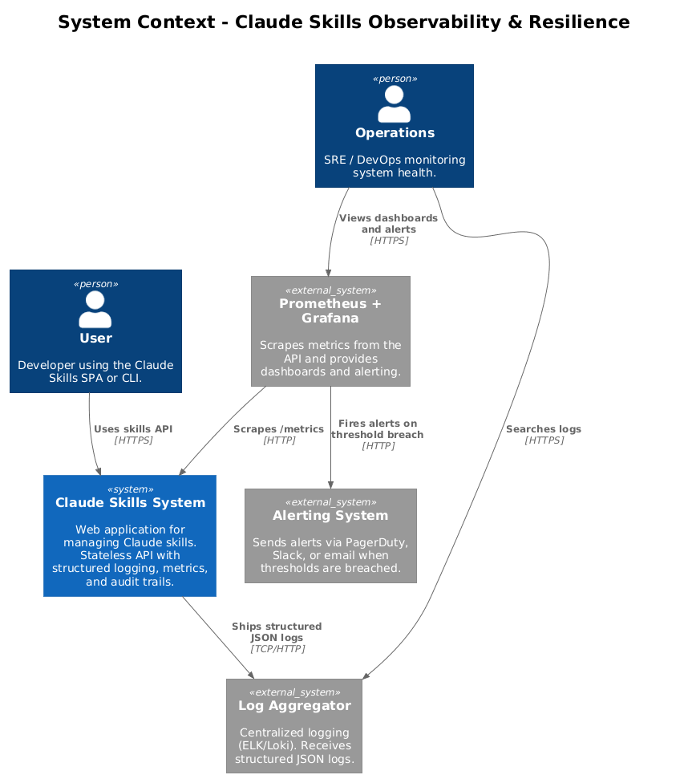
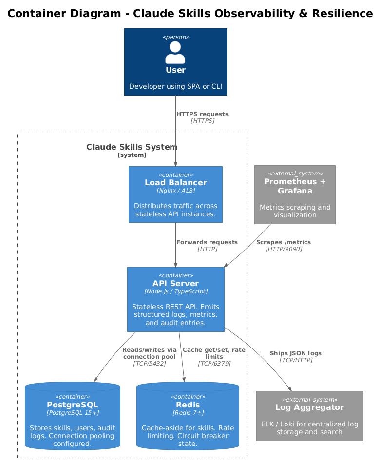
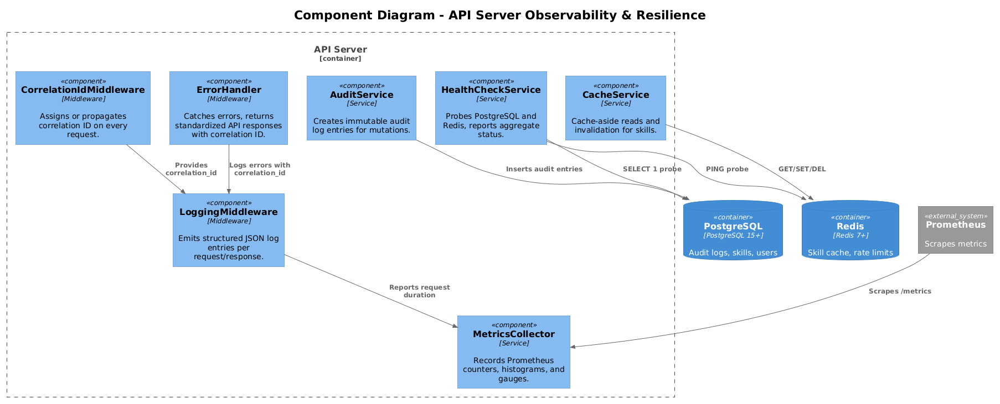
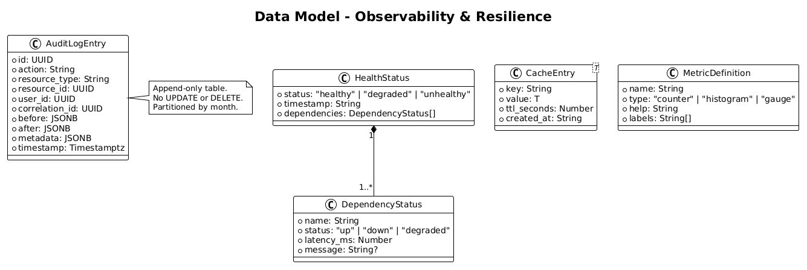
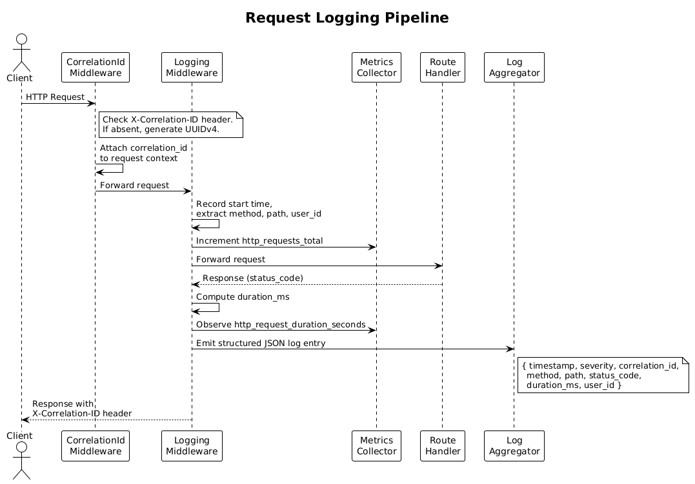
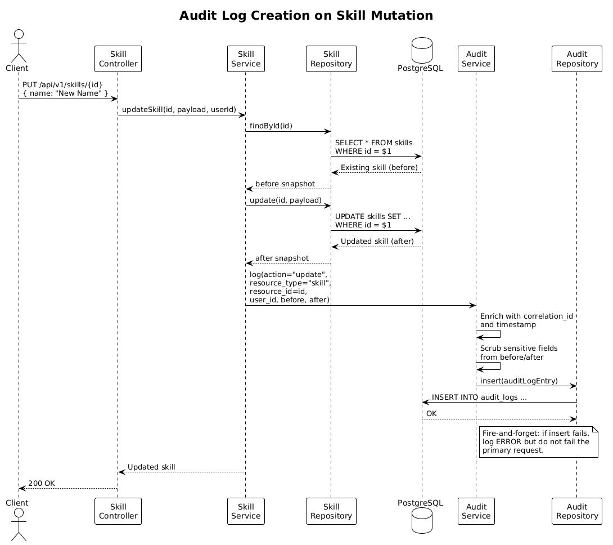
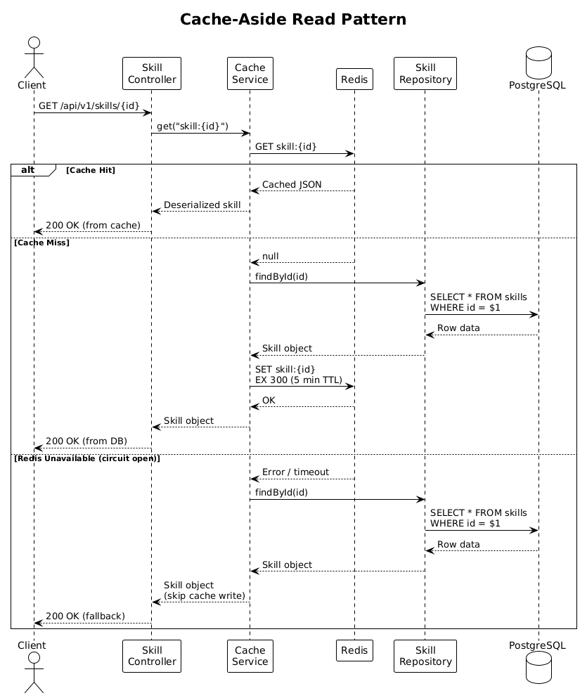

# Feature 08: Observability & Resilience

## 1. Overview

This feature provides structured logging, audit trails, health monitoring, metrics collection, caching, connection pooling, and resilient error handling for the Claude Skills management application. Together these capabilities ensure the system is observable, performant, and gracefully handles failures.

### Capabilities Summary

- Structured JSON logging with correlation IDs on every request
- Immutable append-only audit log for all mutations (skills, auth events)
- Health check endpoints exposing dependency status (PostgreSQL, Redis)
- Prometheus-format metrics: request counts, latency histograms, active connections, error rates
- Cache-aside pattern with Redis for frequently read skills
- Configurable database connection pooling
- Standardized API error responses with correlation IDs
- Circuit breaker pattern for external dependency calls

### Requirements Traceability

| Requirement | Description |
|-------------|-------------|
| L1-007 | Logging & Observability |
| L1-009 | Performance & Scalability |
| L1-011 | Error Handling & Resilience |
| L2-021 | Structured Logging |
| L2-022 | Audit Logging |
| L2-023 | Health Checks and Metrics |
| L2-027 | API Response Time Targets |
| L2-028 | Horizontal Scalability |
| L2-029 | Database Connection Pooling and Caching |
| L2-032 | API Error Responses |

---

## 2. Architecture

### 2.1 System Context

The Claude Skills system exports logs to a centralized log aggregator, metrics to Prometheus/Grafana, and receives alerts from an alerting system when thresholds are breached.




### 2.2 Container View

The API Server is stateless and sits behind a load balancer. PostgreSQL provides persistent storage, Redis provides caching and rate-limit state, Prometheus scrapes metrics, and log output is shipped to a centralized aggregator.



### 2.3 Component View (API Server)

Inside the API server, observability and resilience are handled by middleware and services that intercept every request.



| Component | Responsibility |
|-----------|---------------|
| `CorrelationIdMiddleware` | Assigns or propagates a `correlation_id` on every request. |
| `LoggingMiddleware` | Emits structured JSON log entries for each request/response cycle. |
| `ErrorHandler` | Catches unhandled errors and formats standardized API error responses. |
| `AuditService` | Records immutable audit log entries for all mutations. |
| `AuditRepository` | Persists and queries audit log entries in PostgreSQL. |
| `HealthCheckService` | Probes PostgreSQL and Redis; reports aggregate health status. |
| `MetricsCollector` | Records Prometheus counters, histograms, and gauges for all requests. |
| `CacheService` | Implements cache-aside pattern using Redis for skill reads. |
| `ConnectionPoolManager` | Configures and monitors the PostgreSQL connection pool. |
| `CircuitBreaker` | Wraps calls to external dependencies; opens circuit on repeated failures. |

---

## 3. Component Details

### 3.1 CorrelationIdMiddleware

**Location:** `src/middleware/correlation-id.middleware.ts`

**Behavior:**
- Checks the incoming request for an `X-Correlation-ID` header.
- If present, uses the provided value. If absent, generates a new UUIDv4.
- Attaches the `correlation_id` to the request context so all downstream components can access it.
- Sets the `X-Correlation-ID` response header on the outgoing response.

**Dependencies:** None (stateless utility).

### 3.2 LoggingMiddleware

**Location:** `src/middleware/logging.middleware.ts`

**Behavior:**
- Runs after `CorrelationIdMiddleware`.
- On request start: records timestamp and extracts `method`, `path`, `user_id` (from JWT if present).
- On response finish: computes `duration_ms`, captures `status_code`, and emits a structured JSON log entry.

**Log entry format (L2-021):**

```json
{
  "timestamp": "2026-04-01T12:00:00.000Z",
  "severity": "INFO",
  "correlation_id": "550e8400-e29b-41d4-a716-446655440000",
  "method": "GET",
  "path": "/api/v1/skills/abc-123",
  "status_code": 200,
  "duration_ms": 42,
  "user_id": "user-uuid-here"
}
```

**Severity levels:** `DEBUG`, `INFO`, `WARN`, `ERROR`, `FATAL`

**Severity assignment:**
- `2xx` responses: `INFO`
- `4xx` responses: `WARN`
- `5xx` responses: `ERROR`
- Unhandled exceptions: `FATAL`

**PII scrubbing:**
- Request bodies are never logged in full.
- Fields matching patterns `password`, `token`, `secret`, `authorization`, `cookie` are redacted to `"[REDACTED]"` if they appear in any logged context.
- The `user_id` is a UUID, not PII, and is safe to log.

**Dependencies:** `CorrelationIdMiddleware`

### 3.3 AuditService

**Location:** `src/services/audit.service.ts`

**Responsibilities:**
- Called by controllers/services after any mutation (create, update, delete skill; auth events like login, logout, password change, role change).
- Constructs an `AuditLogEntry` with `before` and `after` snapshots for update operations.
- Delegates persistence to `AuditRepository`.
- Audit writes must not block the primary request. Use fire-and-forget with error logging if the audit write fails (the primary operation should still succeed).

**Dependencies:** `AuditRepository`, `CorrelationIdMiddleware` (for correlation_id)

### 3.4 AuditRepository

**Location:** `src/repositories/audit.repository.ts`

**Responsibilities:**
- Inserts audit log entries into the `audit_logs` table.
- The table uses append-only semantics: no UPDATE or DELETE operations are permitted. The application-level repository enforces this by only exposing `insert` and `query` methods.
- Supports querying by `user_id`, `resource_type`, `action`, and date range (`from`/`to`).
- Results are returned in descending chronological order with cursor-based pagination.

**Dependencies:** PostgreSQL (via query builder)

### 3.5 HealthCheckService

**Location:** `src/services/health-check.service.ts`

**Responsibilities:**
- Probes each dependency with a lightweight check:
  - **PostgreSQL:** Executes `SELECT 1` with a 3-second timeout.
  - **Redis:** Executes `PING` with a 2-second timeout.
- Returns aggregate status: `healthy` (all dependencies up), `degraded` (at least one dependency slow or failing), `unhealthy` (critical dependency down).
- If any dependency is degraded or unhealthy, the `GET /health` endpoint returns HTTP 503.

**Dependencies:** PostgreSQL connection pool, Redis client

### 3.6 MetricsCollector

**Location:** `src/services/metrics-collector.service.ts`

**Responsibilities:**
- Exposes Prometheus-format metrics at `GET /metrics`.
- Metrics collected:
  - `http_requests_total` (counter) -- labels: `method`, `path`, `status_code`
  - `http_request_duration_seconds` (histogram) -- labels: `method`, `path`; buckets: 0.01, 0.05, 0.1, 0.25, 0.5, 1.0, 2.5, 5.0
  - `db_active_connections` (gauge) -- current active connections in the pool
  - `db_idle_connections` (gauge) -- current idle connections in the pool
  - `cache_hits_total` (counter) -- Redis cache hits
  - `cache_misses_total` (counter) -- Redis cache misses
  - `http_errors_total` (counter) -- labels: `status_code`

**Dependencies:** Prometheus client library

### 3.7 CacheService

**Location:** `src/services/cache.service.ts`

**Responsibilities:**
- Implements the cache-aside pattern for skill reads.
- **Read path:** Check Redis for `skill:{id}`. On hit, return cached value. On miss, query PostgreSQL, store result in Redis with a configurable TTL (default: 5 minutes), and return.
- **Write path:** On any skill create, update, or delete, invalidate the specific key `skill:{id}` and the list cache keys matching `skills:list:*`.
- All cache operations have a 500ms timeout; on timeout or Redis error, fall through to the database (cache failure must never block requests).
- Serialization: JSON with `created_at`/`updated_at` as ISO 8601 strings.

**Dependencies:** Redis client

### 3.8 ConnectionPoolManager

**Location:** `src/services/connection-pool.service.ts`

**Responsibilities:**
- Configures the PostgreSQL connection pool with environment-driven settings:
  - `DB_POOL_MIN` (default: 2)
  - `DB_POOL_MAX` (default: 20)
  - `DB_POOL_IDLE_TIMEOUT_MS` (default: 10000)
  - `DB_POOL_ACQUIRE_TIMEOUT_MS` (default: 5000)
- Exposes pool metrics (active, idle, waiting) to `MetricsCollector`.
- Logs a `WARN` when the pool reaches 80% utilization.

**Dependencies:** PostgreSQL driver, `MetricsCollector`

### 3.9 ErrorHandler

**Location:** `src/middleware/error-handler.middleware.ts`

**Responsibilities:**
- Global error-handling middleware; catches all unhandled errors.
- Maps errors to standardized API responses (L2-032):

| Scenario | Status | Response Body |
|----------|--------|---------------|
| Validation failure | 400 | `{ "error": "VALIDATION_ERROR", "details": [{ "field": "name", "message": "is required" }] }` |
| Authentication failure | 401 | `{ "error": "UNAUTHORIZED" }` |
| Authorization failure | 403 | `{ "error": "FORBIDDEN" }` |
| Resource not found | 404 | `{ "error": "NOT_FOUND", "message": "Skill not found.", "docs": "https://docs.skills.example.com/api/errors#not-found" }` |
| Internal server error | 500 | `{ "error": "INTERNAL_ERROR", "correlation_id": "550e8400-..." }` |

- Internal error details (stack traces, database errors) are never exposed to the client. They are logged at `ERROR` severity with the `correlation_id` for debugging.
- The `correlation_id` is always included in 5xx responses so users can reference it in support requests.

**Dependencies:** `CorrelationIdMiddleware`, `LoggingMiddleware`

### 3.10 CircuitBreaker

**Location:** `src/services/circuit-breaker.service.ts`

**Responsibilities:**
- Wraps calls to external dependencies (Redis, potentially external APIs).
- States: `CLOSED` (normal), `OPEN` (failing, requests short-circuited), `HALF_OPEN` (testing recovery).
- Configuration:
  - `failureThreshold`: 5 consecutive failures to open the circuit.
  - `resetTimeout`: 30 seconds before transitioning from `OPEN` to `HALF_OPEN`.
  - `successThreshold`: 2 consecutive successes in `HALF_OPEN` to close the circuit.
- When the circuit is open, calls return immediately with a fallback (e.g., cache miss falls through to DB; health check reports dependency as degraded).
- State transitions are logged at `WARN` severity.

**Dependencies:** None (generic wrapper)

---

## 4. Data Model



### 4.1 Tables

#### `audit_logs`

| Column | Type | Constraints |
|--------|------|-------------|
| `id` | UUID | PK, default `gen_random_uuid()` |
| `action` | VARCHAR(50) | NOT NULL. Values: `create`, `update`, `delete`, `login`, `logout`, `password_change`, `role_change` |
| `resource_type` | VARCHAR(50) | NOT NULL. Values: `skill`, `user`, `session`, `share` |
| `resource_id` | UUID | NOT NULL |
| `user_id` | UUID | NOT NULL, FK -> `users.id` |
| `correlation_id` | UUID | NOT NULL |
| `before` | JSONB | NULL (null for create/auth events) |
| `after` | JSONB | NULL (null for delete events) |
| `metadata` | JSONB | NULL. Additional context (IP address, user agent). |
| `timestamp` | TIMESTAMPTZ | NOT NULL, DEFAULT `now()` |

**Immutability enforcement:**
- No UPDATE or DELETE operations in the repository layer.
- A PostgreSQL trigger or rule (`CREATE RULE ... AS ON UPDATE TO audit_logs DO INSTEAD NOTHING`) prevents any modification at the database level.
- The table is partitioned by month on `timestamp` for efficient querying and archival.

#### Indexes on `audit_logs`

- `audit_logs(user_id, timestamp DESC)` -- query by user
- `audit_logs(resource_type, timestamp DESC)` -- query by resource type
- `audit_logs(action, timestamp DESC)` -- query by action
- `audit_logs(timestamp DESC)` -- date range queries
- `audit_logs(correlation_id)` -- lookup by correlation ID

### 4.2 Domain Types

#### HealthStatus

```typescript
interface HealthStatus {
  status: "healthy" | "degraded" | "unhealthy";
  timestamp: string; // ISO 8601
  dependencies: {
    name: string;         // "postgresql" | "redis"
    status: "up" | "down" | "degraded";
    latency_ms: number;
    message?: string;     // Optional error message when not up
  }[];
}
```

#### CacheEntry

```typescript
interface CacheEntry<T> {
  key: string;          // e.g., "skill:abc-123"
  value: T;
  ttl_seconds: number;  // Time remaining
  created_at: string;   // ISO 8601
}
```

#### MetricDefinition

```typescript
interface MetricDefinition {
  name: string;
  type: "counter" | "histogram" | "gauge";
  help: string;
  labels: string[];
}
```

#### AuditLogEntry

```typescript
interface AuditLogEntry {
  id: string;
  action: string;
  resource_type: string;
  resource_id: string;
  user_id: string;
  correlation_id: string;
  before: Record<string, unknown> | null;
  after: Record<string, unknown> | null;
  metadata: Record<string, unknown> | null;
  timestamp: string; // ISO 8601
}
```

---

## 5. Key Workflows

### 5.1 Request Logging Pipeline



1. An HTTP request arrives at the API server.
2. `CorrelationIdMiddleware` checks for `X-Correlation-ID` header. If absent, generates a UUIDv4 and attaches it to the request context.
3. `LoggingMiddleware` records the request start time and extracts `method`, `path`, and `user_id` (if authenticated).
4. `MetricsCollector` increments `http_requests_total` for the given method and path.
5. The request proceeds through authentication, authorization, and business logic.
6. On response completion, `LoggingMiddleware` computes `duration_ms`, captures `status_code`, and emits a structured JSON log entry.
7. `MetricsCollector` observes the duration in the `http_request_duration_seconds` histogram.
8. The `X-Correlation-ID` header is set on the response.

### 5.2 Audit Log Creation



1. A mutation request (e.g., `PUT /api/v1/skills/{id}`) completes successfully.
2. The controller calls `AuditService.log()` with `action`, `resource_type`, `resource_id`, `user_id`, and `before`/`after` snapshots.
3. `AuditService` enriches the entry with `correlation_id` from the request context and `timestamp`.
4. `AuditService` calls `AuditRepository.insert()` to persist the entry.
5. If the insert fails, the error is logged at `ERROR` severity but the primary response is not affected (fire-and-forget).
6. The response is returned to the client.

### 5.3 Health Check Execution

1. A request arrives at `GET /health`.
2. `HealthCheckService` probes PostgreSQL with `SELECT 1` (3s timeout).
3. `HealthCheckService` probes Redis with `PING` (2s timeout).
4. Results are aggregated:
   - All up: `{ "status": "healthy" }`, HTTP 200.
   - At least one degraded or down: `{ "status": "degraded" }` or `{ "status": "unhealthy" }`, HTTP 503.
5. Each dependency includes its `latency_ms` and an optional error `message`.

### 5.4 Cache-Aside Read Pattern



1. A request arrives at `GET /api/v1/skills/{id}`.
2. The service layer calls `CacheService.get("skill:{id}")`.
3. `CacheService` queries Redis for the key.
4. **Cache hit:** Return the deserialized skill object immediately.
5. **Cache miss:** Query PostgreSQL for the skill.
6. If found, serialize the skill to JSON and store in Redis with key `skill:{id}` and a 5-minute TTL.
7. Return the skill object.
8. If Redis is unavailable (circuit breaker open or timeout), skip the cache entirely and serve directly from PostgreSQL.

### 5.5 Cache Invalidation on Write

1. A skill is created, updated, or deleted via the API.
2. After the database write succeeds, the service calls `CacheService.invalidate("skill:{id}")`.
3. `CacheService` deletes the key `skill:{id}` from Redis.
4. `CacheService` also deletes keys matching `skills:list:*` (list caches) using a scan-and-delete pattern.
5. Cache invalidation failures are logged at `WARN` severity but do not fail the request. The TTL provides eventual consistency.

### 5.6 Circuit Breaker Activation

1. The `CircuitBreaker` wraps calls to Redis (and any other external dependency).
2. When a call fails, the failure counter increments.
3. After 5 consecutive failures, the circuit transitions from `CLOSED` to `OPEN`. A `WARN` log is emitted.
4. While `OPEN`, all calls return immediately with a fallback (e.g., cache operations fall through to DB).
5. After 30 seconds, the circuit transitions to `HALF_OPEN` and allows a single probe request.
6. If the probe succeeds, the circuit transitions back to `CLOSED` after 2 consecutive successes.
7. If the probe fails, the circuit returns to `OPEN` for another 30 seconds.

---

## 6. API Contracts

### 6.1 GET `/health`

**Description:** Returns the health status of the system and its dependencies.

**Authentication:** None required. However, detailed dependency information should only be returned to authenticated admin users. Unauthenticated requests receive a simple status.

**Response (200 -- all dependencies healthy):**

```json
{
  "status": "healthy",
  "timestamp": "2026-04-01T12:00:00.000Z",
  "dependencies": [
    {
      "name": "postgresql",
      "status": "up",
      "latency_ms": 2
    },
    {
      "name": "redis",
      "status": "up",
      "latency_ms": 1
    }
  ]
}
```

**Response (503 -- at least one dependency degraded):**

```json
{
  "status": "degraded",
  "timestamp": "2026-04-01T12:00:05.000Z",
  "dependencies": [
    {
      "name": "postgresql",
      "status": "up",
      "latency_ms": 3
    },
    {
      "name": "redis",
      "status": "down",
      "latency_ms": 2000,
      "message": "Connection timeout"
    }
  ]
}
```

### 6.2 GET `/metrics`

**Description:** Returns metrics in Prometheus exposition format.

**Authentication:** Should be restricted to internal/monitoring networks or require an API key. Not exposed to public internet.

**Response (200):**

```
# HELP http_requests_total Total number of HTTP requests
# TYPE http_requests_total counter
http_requests_total{method="GET",path="/api/v1/skills",status_code="200"} 1542

# HELP http_request_duration_seconds HTTP request duration in seconds
# TYPE http_request_duration_seconds histogram
http_request_duration_seconds_bucket{method="GET",path="/api/v1/skills",le="0.1"} 1300
http_request_duration_seconds_bucket{method="GET",path="/api/v1/skills",le="0.25"} 1480
http_request_duration_seconds_bucket{method="GET",path="/api/v1/skills",le="0.5"} 1530
http_request_duration_seconds_bucket{method="GET",path="/api/v1/skills",le="+Inf"} 1542
http_request_duration_seconds_sum{method="GET",path="/api/v1/skills"} 145.23
http_request_duration_seconds_count{method="GET",path="/api/v1/skills"} 1542

# HELP db_active_connections Number of active database connections
# TYPE db_active_connections gauge
db_active_connections 8

# HELP db_idle_connections Number of idle database connections
# TYPE db_idle_connections gauge
db_idle_connections 12

# HELP cache_hits_total Total number of cache hits
# TYPE cache_hits_total counter
cache_hits_total 4521

# HELP cache_misses_total Total number of cache misses
# TYPE cache_misses_total counter
cache_misses_total 876

# HELP http_errors_total Total number of HTTP errors
# TYPE http_errors_total counter
http_errors_total{status_code="400"} 23
http_errors_total{status_code="500"} 2
```

### 6.3 GET `/api/v1/audit-logs`

**Description:** Query audit log entries. Restricted to admin users.

**Authentication:** Required. Must have `admin` role.

**Query parameters:**

| Parameter | Type | Required | Description |
|-----------|------|----------|-------------|
| `user_id` | UUID | No | Filter by the user who performed the action. |
| `resource_type` | string | No | Filter by resource type (`skill`, `user`, `session`, `share`). |
| `action` | string | No | Filter by action (`create`, `update`, `delete`, `login`, `logout`, `password_change`, `role_change`). |
| `from` | ISO 8601 | No | Start of date range (inclusive). |
| `to` | ISO 8601 | No | End of date range (inclusive). |
| `cursor` | string | No | Cursor for pagination (opaque string, returned in previous response). |
| `limit` | integer | No | Page size (default: 50, max: 200). |

**Response (200):**

```json
{
  "data": [
    {
      "id": "log-uuid-1",
      "action": "update",
      "resource_type": "skill",
      "resource_id": "skill-uuid-1",
      "user_id": "user-uuid-1",
      "correlation_id": "corr-uuid-1",
      "before": { "name": "Old Name", "description": "Old description" },
      "after": { "name": "New Name", "description": "Updated description" },
      "metadata": { "ip": "192.168.1.1", "user_agent": "Mozilla/5.0..." },
      "timestamp": "2026-04-01T11:30:00.000Z"
    }
  ],
  "pagination": {
    "cursor": "eyJ0cyI6IjIwMjYtMDQtMDFUMTE6MzA6MDAuMDAwWiJ9",
    "has_more": true
  }
}
```

**Response (401):**

```json
{ "error": "UNAUTHORIZED" }
```

**Response (403):**

```json
{ "error": "FORBIDDEN" }
```

---

## 7. Security Considerations

### 7.1 PII Scrubbing in Logs

- Structured log entries never include request or response bodies.
- Any field name matching `password`, `token`, `secret`, `authorization`, `cookie`, `ssn`, `credit_card` is automatically redacted.
- The `before`/`after` fields in audit logs must also be scrubbed: sensitive fields (e.g., `password_hash`) are replaced with `"[REDACTED]"` before persistence.
- Log output is tested with a CI check that scans for common PII patterns (email addresses in non-`user_id` fields, bearer tokens, etc.).

### 7.2 Audit Log Immutability

- The `audit_logs` table has a PostgreSQL rule that prevents UPDATE and DELETE:
  ```sql
  CREATE RULE audit_logs_no_update AS ON UPDATE TO audit_logs DO INSTEAD NOTHING;
  CREATE RULE audit_logs_no_delete AS ON DELETE TO audit_logs DO INSTEAD NOTHING;
  ```
- The application database user for normal operations should not have `TRUNCATE` privilege on `audit_logs`.
- A separate read-only database user is used for audit log queries where possible.
- Monthly partitioning enables efficient archival: old partitions can be detached and moved to cold storage without affecting the active table.

### 7.3 Metrics Endpoint Access Control

- `GET /metrics` must not be exposed on the public-facing port. Options:
  - Serve metrics on a separate internal port (e.g., 9090) that is only accessible within the cluster network.
  - Require an API key in the `Authorization` header for Prometheus scrape requests.
- Metrics data itself does not contain PII, but high-cardinality labels (e.g., user IDs in path params) must be normalized to avoid information leakage and metric explosion.
- Path labels are normalized: `/api/v1/skills/abc-123` becomes `/api/v1/skills/:id`.

### 7.4 Health Check Information Disclosure

- Unauthenticated `GET /health` requests return only the aggregate status (`healthy`, `degraded`, `unhealthy`) without dependency details.
- Detailed dependency information (names, latencies, error messages) is included only when the request is authenticated with an admin token.

---

## 8. Open Questions

| # | Question | Context |
|---|----------|---------|
| 1 | Should audit logs be stored in a separate database or schema? | Isolating audit data improves security and prevents accidental modification. It also simplifies compliance audits. |
| 2 | What is the retention policy for audit logs? | Monthly partitioning enables archival, but we need to define how long data remains in the active database vs. cold storage. |
| 3 | Should we use a separate log shipping agent (Filebeat, Promtail) or log directly to the aggregator? | Agent-based shipping is more resilient to aggregator downtime; direct shipping reduces infrastructure. |
| 4 | Should the circuit breaker configuration be per-dependency or global? | Redis and PostgreSQL may have different failure characteristics and recovery times. |
| 5 | What alerting thresholds should trigger PagerDuty/Slack notifications? | Need to define thresholds for error rate, P99 latency, circuit breaker openings, and pool exhaustion. |
| 6 | Should cache TTL be configurable per resource type? | Skills may benefit from longer TTL than other cached resources. |
| 7 | Do we need a readiness probe separate from the liveness health check? | Kubernetes deployments typically use both: liveness for restart, readiness for traffic routing. |
